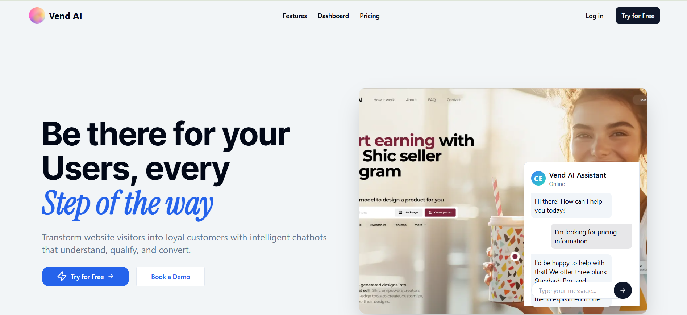

# 🤖 Vend-AI

**Transform Your Customer Engagement with AI-Powered Support**



Vend-AI is a comprehensive AI-powered customer support platform that enables businesses to add fully customizable AI chatbots to their websites. From intelligent conversations to appointment booking and email marketing - everything you need to elevate your customer experience.

## ✨ Key Features

### 🧠 **Intelligent AI Chatbot**
- **Smart Email Collection**: Automatically captures customer emails during conversations
- **OpenAI Integration**: Powered by advanced AI for natural, contextual responses
- **24/7 Availability**: Never miss a customer inquiry
- **Fully Customizable**: Match your brand's look and feel

### 💬 **Real-Time Communication**
- **Live Chat Management**: View all customer conversations in real-time
- **Pusher Integration**: Instant messaging for immediate responses
- **Admin Takeover**: Jump into conversations and chat directly with customers
- **Complete Chat History**: Track all customer interactions

### 📅 **Appointment Booking System**
- **In-Chat Booking**: Customers can schedule appointments through the chatbot
- **Appointment Dashboard**: Centralized management of all bookings
- **Calendar Integration**: Organized scheduling for your business

### 📧 **Email Marketing Platform**
- **Campaign Creation**: Build and design professional email campaigns
- **Automated List Building**: Grow your email list from chatbot interactions
- **Customer Segmentation**: Target specific groups based on chat data
- **Campaign Analytics**: Track performance and engagement

### 🚀 **Easy 3-Step Setup**
1. **Add Domain**: Enter your website domain from the sidebar
2. **Choose Tech Stack**: Select your framework and copy the installation code
3. **Go Live**: Your AI chatbot is now active on your website

## 🛠️ Tech Stack

### **Frontend**
- **Next.js 14+** with App Router
- **TypeScript** for type safety
- **Tailwind CSS** for styling
- **Shadcn/ui** component library
- **Framer Motion** for animations

### **Backend & Database**
- **Prisma ORM** for database management
- **PostgreSQL** on Neon cloud
- **Custom JWT Authentication**
- **RESTful API** architecture

### **AI & Communication**
- **OpenAI API** for intelligent responses
- **Pusher** for real-time messaging
- **Nodemailer** for email campaigns

### **Integrations**
- **Stripe** for payment processing
- **Uploadcare** for file management
- **Gmail SMTP** for email delivery

## 🚀 Getting Started

### Prerequisites
- Node.js 18+ 
- PostgreSQL database
- OpenAI API key
- Pusher account
- Stripe account (for payments)

### Installation

1. **Clone the repository**
   ```bash
   git clone https://github.com/shreenarayan123/vendai-test.git
   cd vendai-test2
   ```

2. **Install dependencies**
   ```bash
   npm install
   ```

3. **Set up environment variables**
   Create a `.env` file in the root directory:
   ```env
   # Database
   DATABASE_URL="your_postgresql_connection_string"
   
   # Authentication
   JWT_SECRET="your_jwt_secret"
   
   # OpenAI
   OPEN_AI_KEY="your_openai_api_key"
   
   # Pusher (Real-time messaging)
   NEXT_PUBLIC_PUSHER_APP_ID="your_pusher_app_id"
   NEXT_PUBLIC_PUSHER_APP_KEY="your_pusher_key"
   NEXT_PUBLIC_PUSHER_APP_SECRET="your_pusher_secret"
   NEXT_PUBLIC_PUSHER_APP_CLUSTOR="your_pusher_cluster"
   
   # Email (NodeMailer)
   NODE_MAILER_EMAIL="your_email@gmail.com"
   NODE_MAILER_GMAIL_APP_PASSWORD="your_app_password"
   NODE_MAILER_HOST="smtp.gmail.com"
   
   # File Upload (Uploadcare)
   NEXT_PUBLIC_UPLOAD_CARE_PUBLIC_KEY="your_uploadcare_public_key"
   UPLOAD_CARE_SECRET_KEY="your_uploadcare_secret_key"
   
   # Stripe
   NEXT_PUBLIC_STRIPE_PUBLISH_KEY="your_stripe_publishable_key"
   NEXT_PUBLIC_STRIPE_SECRET_KEY="your_stripe_secret_key"
   
   # Backend URL
   BACKEND_URL="http://localhost:3000/"
   ```

4. **Set up the database**
   ```bash
   npx prisma generate
   npx prisma db push
   ```

5. **Run the development server**
   ```bash
   npm run dev
   ```

6. **Open your browser**
   Navigate to `http://localhost:3000`

## 📁 Project Structure

```
├── prisma/                 # Database schema & migrations
├── src/
│   ├── app/               # Next.js App Router pages
│   │   ├── (dashboard)/   # Protected dashboard routes
│   │   ├── api/           # API endpoints
│   │   ├── auth/          # Authentication pages
│   │   └── assets/        # Static images and assets
│   ├── components/        # Reusable UI components
│   │   ├── chatbot/       # Chatbot interface components
│   │   ├── dashboard/     # Dashboard components
│   │   ├── forms/         # Form components
│   │   └── ui/            # Base UI components
│   ├── actions/           # Server actions
│   ├── hooks/             # Custom React hooks
│   ├── lib/               # Utilities (Prisma, helpers)
│   ├── schemas/           # Validation schemas
│   └── constants/         # Static data
├── public/                # Public assets
└── README.md
```

## 🎯 Use Cases

### **E-commerce Stores**
- Handle product inquiries 24/7
- Collect customer emails for marketing
- Schedule product demos or consultations

### **Service Businesses**
- Answer common questions instantly
- Book appointments automatically
- Follow up with email campaigns

### **SaaS Companies**
- Provide technical support
- Qualify leads through conversations
- Schedule sales calls

### **Healthcare & Professional Services**
- Answer patient/client questions
- Schedule appointments
- Send appointment reminders via email

## 🔧 Configuration

### **Chatbot Customization**
- Colors and branding
- Welcome messages
- Response templates
- Positioning and styling

### **Domain Management**
- Add multiple websites
- Domain-specific settings
- Custom installation codes

### **Email Campaigns**
- Template customization
- Automated sequences
- Performance tracking

## 📊 Analytics & Insights

- **Conversation Analytics**: Track chat volume and topics
- **Customer Insights**: View collected emails and preferences  
- **Appointment Metrics**: Monitor booking rates and trends
- **Email Performance**: Track open rates and click-through rates

## 🔒 Security

- **JWT Authentication**: Secure user sessions
- **Data Encryption**: Protected customer information
- **CORS Protection**: Secure API endpoints
- **Input Validation**: Zod schema validation

## 🚀 Deployment

### **Vercel (Recommended)**
1. Connect your GitHub repository
2. Set environment variables
3. Deploy automatically

### **Other Platforms**
- Netlify
- Railway
- DigitalOcean App Platform

## 🤝 Contributing

1. Fork the repository
2. Create a feature branch (`git checkout -b feature/amazing-feature`)
3. Commit your changes (`git commit -m 'Add amazing feature'`)
4. Push to the branch (`git push origin feature/amazing-feature`)
5. Open a Pull Request

## 📄 License

This project is licensed under the MIT License - see the [LICENSE](LICENSE) file for details.

## 📧 Support

- **Email**: vend.ai.system@gmail.com
- **GitHub Issues**: [Create an issue](https://github.com/shreenarayan123/vendai-test/issues)
- **Documentation**: [Wiki](https://github.com/shreenarayan123/vendai-test/wiki)

## 🎉 Acknowledgments

- **OpenAI** for powerful AI capabilities
- **Pusher** for real-time messaging
- **Vercel** for seamless deployment
- **Shadcn/ui** for beautiful components

---

**Built with ❤️ by the Vend-AI Team**

Transform your customer engagement today with intelligent AI-powered support!
